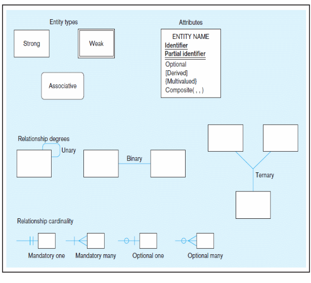

## USEFUL DEFINITIONS

**Metadata**: data that describes the properties and context of a user data. eg: data types filed sizes, allowable values, etc. 
the object is defined in terms of metadata

## DISADVANTAGES OF FILE PROCESSING
* **Program_data dependence**: program and data are tightly connected, such that a change in the program will require u to rewrite the program.
* **Duplication of data**: different copies of the same data.
* **Limited data storage**
* **Lengthy development times**: programmers must design their own file formats and write their own codes for different operations.
* **Excessive Program maintenance**: small changes require, change in programs, which will consume time and resources.

### PROBLEMS WITH DATA DEPENDENCY
* Each dev must maintain his own data
* Each app includes code for metadata for each file
* Each file with its own processing routine
* Lack of central control system of files
* Non-standard file formats.

### PROBLEMS WITH DATA REDUNDANCY
* High cost of maintenance
* High cost of data storage
* Data changes could compromise data integrity

*The solution to all problems of file system is DATABASE SYSTEM*

## DATABASE MANAGEMENT SYSTEMS 

### ADVANTAGES OF THE DATABASE APPROACH
* Program data independence
* Planned data redundancy
* Improved data consistency
* Improved data sharing
* Increased application development productivity
* Enforcement of standards
* Improved data accessibility
* Improved data quality
* Reduced program maintenance

### RISKS OF THE DATABASE APPROACH
* New specialized personel. eg: database admins, sql experts,.
* Installationa and management cost and complexity. eg, machines, network setup, security systems, etc.
* conversion cost: eg: rewriting programs, training staff.
* Need for explicit backup and recovery. 
* Organization conflict: policy disagreements,power struggles.

## ELEMENT OF THE DATABASE APPROACH 
### DATA MODELS
* A graphical representation of how data is structured and related in a database.
* blueprint of the database.
* **Enterprise data model**: high level model showing major organizational entities and relationships.

* **Project Data**: detailed, low level design for building actual database.

### ENTITIES
* Real world objects or events about which data is stored in a database.
* Entity types: collection of entities that share common properties.
* Entity Instance: A single occurence of an entity type.
* They have many attributes, instances, an object.
* Cannot be a user or an attribute.

#### Types of Entities
* **Strong Entities**: They exist on their own and have unique identifiers(PK).
* **Weak Entities**: Cannot exist on their own, depends on strong entities. Drawn with a line joining to strong entities.

* **Associative**: introduced in resolve of complexities resulting from many to many relationships.

### Attributes
* Properties that describe an entity that are of interest to the organization.
* Required and Optional attributes
* Simple and Composite attributes
* Single valued and Multivalued Attributes
* Stored and Derived Attributes
* Identifier attributes: uniquely stores individual instances of an entity type.
* eg: Name, age, Program, etc.

### Relationship
* Shows how entities are connected.
* 1:M relationships 
* M:M relationship
* M:1 relationship
* 1:1 relationship

### RELATIONAL DATABASES
* Databases that stores data in tables (called relations) using primary keys and foreign keys to represent relationships.
* Each table represents an entity.

**ASSIGNMENT**
Identify any organization of your choice and outline their business processes using 
Develop an entity relation solution that...